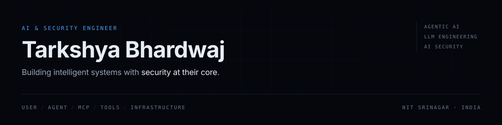
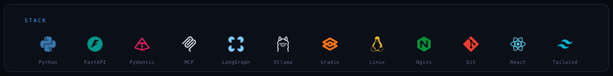

<picture>
  <source media="(prefers-color-scheme: dark)" srcset="assets/banner-dark.svg">
  <source media="(prefers-color-scheme: light)" srcset="assets/banner-light.svg">
  
</picture>

I build systems where models move past conversations, connecting to real tools, APIs, data, and infrastructure and work out the security boundaries that appear once a model is given the ability to act. Most recently **Information Security Intern at PayU** (Dec 2025 – Mar 2026), building agentic AI into enterprise security workflows on live infrastructure.

> An LLM is a reasoning component inside a system, not the architecture itself. Tool access is where the security lives, giving an agent API access is giving it execution privilege, so it gets scoped like one.

## 01 · Selected work

- **Risk Register Chatbot** · `PayU — internal` : A conversational agent that reads and acts on the enterprise Risk Register. Python/FastAPI backend, MCP tool layer, Jira API integrations, deployed on Amazon Linux EC2 behind Nginx.
- **[Agentic AI with Frameworks](https://github.com/Tarkshya-26/Agentic_AI_with_Frameworks)** : Hands on implementations of agentic systems across OpenAI Agents SDK, CrewAI, LangGraph, AutoGen, and MCP.
- **[LLM Engineering](https://github.com/Tarkshya-26/LLM-Engineering)** : RAG, embeddings, reranking, and retrieval evaluation (MRR/nDCG), alongside tool calling and open-source models.
- **[AI Security](https://github.com/Tarkshya-26/AI_Security)** : Notes, labs, and threat models from the TryHackMe AI Security path: LLM attack surfaces, prompt injection, RAG and agent vulnerabilities, and model supply chain.
- **Personal AI Chatbot** : Fully local inference: Qwen served through Ollama with a Gradio interface, no cloud APIs.

## 02 · Stack

<picture>
  <source media="(prefers-color-scheme: dark)" srcset="assets/stack-dark.svg">
  <source media="(prefers-color-scheme: light)" srcset="assets/stack-light.svg">
  
</picture>

**Agents** : OpenAI Agents SDK · CrewAI *(strongest hands-on)* · LangGraph · AutoGen · multi-agent orchestration 
**LLM** : RAG · embeddings & reranking · retrieval evaluation · structured outputs · local inference 
**Security** : LLM attack surfaces · prompt injection · scoped tool exposure · risk management workflows 
**Infra** : AWS EC2 · Amazon Linux · Nginx · Git

## 03 · Certifications

**Completed** —> The Complete Agentic AI Engineering Course (Ed Donner) · TryHackMe Pre Security · TryHackMe AI Security 
**In progress** —> LLM Engineering (Ed Donner)

## 04 · Activity

<picture>
  <source media="(prefers-color-scheme: dark)" srcset="https://streak-stats.demolab.com?user=Tarkshya-26&hide_border=true&background=0b0f18&stroke=1c2740&ring=4d9fff&fire=4d9fff&currStreakLabel=93a1b8&sideLabels=93a1b8&dates=5a6883&sideNums=e7edf7&currStreakNum=e7edf7">
  <source media="(prefers-color-scheme: light)" srcset="https://streak-stats.demolab.com?user=Tarkshya-26&hide_border=true&background=ffffff&stroke=d8e0ee&ring=1f6feb&fire=1f6feb&currStreakLabel=48566d&sideLabels=48566d&dates=7b89a0&sideNums=0d1520&currStreakNum=0d1520">
  
</picture>

<picture>
  <source media="(prefers-color-scheme: dark)" srcset="https://github-readme-activity-graph.vercel.app/graph?username=Tarkshya-26&hide_border=true&bg_color=0b0f18&color=93a1b8&line=4d9fff&point=4d9fff&title_color=4d9fff&area=true">
  <source media="(prefers-color-scheme: light)" srcset="https://github-readme-activity-graph.vercel.app/graph?username=Tarkshya-26&hide_border=true&bg_color=ffffff&color=48566d&line=1f6feb&point=1f6feb&title_color=1f6feb&area=true">
  
</picture>

## 05 · Connect

Open to work in Agentic AI, LLM Engineering, and AI Security. 
Outside engineering I'm Production Head at **The Unheard Mehfil**, a podcast with 600K+ cumulative views.

---

> `> EOF -> build something intelligent today.`

