<div align="center">
  
</div>

<br/>

<div align="center">
  
</div>

<br/>

## `01 / ABOUT`

```
LOCATION: NIT Srinagar, India
FOCUS:    Intelligent Systems • Security at System Level • Tool Integration
PRIMARY:  Python / FastAPI / MCP / LangGraph / OpenAI Agents SDK
```

> **I build intelligent systems that connect models with tools, APIs, data and real-world infrastructure — with security considered at the system level.**

I am an Information Technology undergraduate at **NIT Srinagar** operating at the convergence of **LLM Engineering, Agentic Architectures, and AI Security**. 

Rather than viewing models as isolated text generators, I design end-to-end architectures where models act as reasoning components within broader systems. My focus is on **state management, tool isolation, deterministic guardrails, structured outputs, and security boundaries**.

<br/>

<div align="center">
  
</div>

<br/>

<div align="center">
  
</div>

<br/>

## `02 / CURRENTLY BUILDING`

<table width="100%">
<tr>
<td width="50%" valign="top">

### `01 / AGENTIC SYSTEMS`
`STATUS: ACTIVE` `DISPATCH: ASYNC`

Exploring multi-agent orchestration, state transitions, tool call routing, and protocol standardization. Working deeply with **OpenAI Agents SDK, LangGraph, CrewAI, AutoGen**, and building custom **MCP (Model Context Protocol)** servers for tool integration.

</td>
<td width="50%" valign="top">

### `02 / LLM ENGINEERING`
`STATUS: ACTIVE` `EVAL: CONTINUOUS`

Building production-grade **RAG pipelines**, hybrid vector search, context compression, semantic routing, and structured output parsing. Translating unstructured model outputs into deterministic, typed schemas for downstream execution.

</td>
</tr>
<tr>
<td width="50%" valign="top">

### `03 / AI SECURITY`
`STATUS: ACTIVE` `SCOPE: CRITICAL`

Designing security controls for agentic execution. Focus on **tool privilege isolation, automated risk triage systems, threat modeling for LLMs**, and agentic security workflows that maintain strict system boundaries.

</td>
<td width="50%" valign="top">

### `04 / PRODUCTION AI`
`STATUS: ACTIVE` `INFRA: CLOUD`

Architecting resilient backend infrastructure using **FastAPI, REST APIs, Docker, and AWS**. Ensuring production AI workloads have proper telemetry, low latencies, rate limiting, and observability.

</td>
</tr>
</table>

<br/>

<div align="center">
  
</div>

<br/>

## `03 / SELECTED WORK`

### `01 // ENTERPRISE RISK REGISTER CHATBOT`
**Role:** Information Security Engineer (`PayU`)  
**Stack:** `FastAPI` • `React` • `MCP` • `LLM Agents` • `AWS` • `Linux` • `REST APIs`

> Engineered an **Agentic AI-based Risk Register system** built around enterprise security and risk-management workflows. Connected AI agents with internal tools and databases, allowing security engineers to conversationally inspect risk telemetry, execute structured risk assessments, and trigger automated security actions via controlled tool interfaces.

---

### `02 // AGENTIC AI WITH FRAMEWORKS`
**Repository:** [`Tarkshya-26/Agentic_AI_with_Frameworks`](https://github.com/Tarkshya-26/Agentic_AI_with_Frameworks)  
**Stack:** `OpenAI Agents SDK` • `LangGraph` • `CrewAI` • `AutoGen` • `MCP` • `Python`

> Hands-on reference implementation of modern agentic architectures. Demonstrates multi-agent coordination, graph-based state machines, dynamic tool calling, memory management, and MCP server integrations.

---

### `03 // LLM ENGINEERING & RAG ARCHITECTURES`
**Repository:** [`Tarkshya-26/LLM_ENG`](https://github.com/Tarkshya-26/LLM_ENG)  
**Stack:** `Python` • `RAG` • `Vector Databases` • `Embeddings` • `FastAPI` • `Structured Outputs`

> Comprehensive suite of production-focused LLM engineering patterns. Covers hybrid retrieval, vector index optimization, semantic search, prompt evaluation, and deterministic wrapper layers around non-deterministic model outputs.

---

### `04 // AI SECURITY & TOOL BOUNDARY SYSTEMS`
**Area:** `Security Engineering & System Isolation`  
**Stack:** `FastAPI` • `Python` • `Security Systems` • `Tool Calling` • `Access Controls`

> Research and implementation of security boundaries for tool-calling agents. Focuses on sandboxing external API access, enforcement of least privilege on agent actions, and automated auditing of AI-triggered actions.

<br/>

<div align="center">
  
</div>

<br/>

## `04 / ENGINEERING STACK`

```
┌─────────────────────────┬────────────────────────────────────────────────────────┐
│ CATEGORY                │ TECHNOLOGIES & TOOLS                                   │
├─────────────────────────┼────────────────────────────────────────────────────────┤
│ LANGUAGE                │ Python • SQL • JavaScript                              │
│ AI / LLM                │ OpenAI • LLM Engineering • RAG • Agents •              │
│                         │ Structured Outputs • Tool Calling                      │
│ AGENT SYSTEMS           │ LangGraph • CrewAI • AutoGen • MCP •                   │
│                         │ OpenAI Agents SDK                                      │
│ BACKEND                 │ FastAPI • Flask • REST APIs                            │
│ INFRASTRUCTURE          │ AWS • EC2 • Nginx • Linux • Git                        │
│ FRONTEND                │ React • Vite • Tailwind                                │
└─────────────────────────┴────────────────────────────────────────────────────────┘
```

<br/>

<div align="center">
  
</div>

<br/>

## `05 / ENGINEERING PRINCIPLES`

```
01 — Models are components, not applications.
     An LLM is a reasoning primitive inside a system, not the architecture itself.

02 — Agents need boundaries.
     Autonomous loops must operate within strict state spaces and explicit termination criteria.

03 — Tool access is a security boundary.
     Granting an agent API access is granting execution privilege — scope it like root.

04 — Production AI needs observability.
     If you cannot trace every prompt, context window, vector lookup, and tool call, you cannot debug it.

05 — Intelligent systems should be designed, not glued together.
     Frameworks change. System design, clean interfaces, and state hygiene remain forever.
```

<br/>

<div align="center">
  
</div>

<br/>

## `06 / CONNECT`

<table width="100%">
<tr>
<td width="25%" align="center">
<br/>
<b>EMAIL</b><br/>
<a href="mailto:tarkshya.bhardwaj@gmail.com"><code>tarkshya.bhardwaj@gmail.com</code></a>
<br/><br/>
</td>
<td width="25%" align="center">
<br/>
<b>LINKEDIN</b><br/>
<a href="https://www.linkedin.com/in/tarkshya-bhardwaj-063795268/"><code>in/tarkshya-bhardwaj</code></a>
<br/><br/>
</td>
<td width="25%" align="center">
<br/>
<b>GITHUB</b><br/>
<a href="https://github.com/Tarkshya-26"><code>github/Tarkshya-26</code></a>
<br/><br/>
</td>
<td width="25%" align="center">
<br/>
<b>RESUME</b><br/>
<a href="mailto:tarkshya.bhardwaj@gmail.com?subject=Resume%20Request"><code>Request Resume</code></a>
<br/><br/>
</td>
</tr>
</table>

<br/>

<div align="center">
  
</div>
